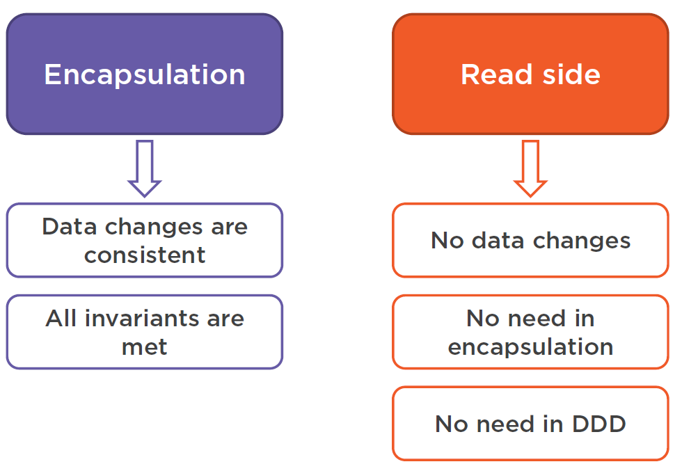
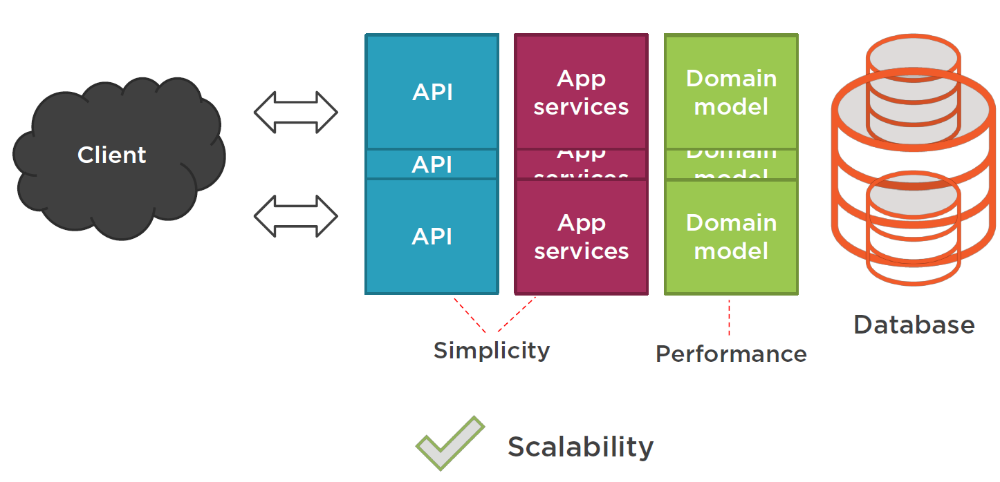

# Software Design & Architecture
This repo aims to track my notes of software design and architecture.

## SOLID Principles

Refer this [course][solid_principles_course] and [repo][solid_demo] by [Steve Smith](https://github.com/ardalis) for more details.

- Single responsibility

  Each software module should have one and only one reason to change.

- Open-close

  Software entities (classes, modules, functions, etc.) should be _open for extension_, but *closed for modification*.

- Liskov substitution

  Subtypes must be substitutable for their base types. Typical violations of LSP are:

  - type checking with `is` or `as` in polymorphic code
  - null checks
  - `NotImplementedException`

- Interface segregation

  Clients should not be forced to depend on methods they do not use. Interfaces should be tailored to the context rather than all-encompassing.

- Dependency inversion

  - High-level modules should not depend on low-level modules. Both should depend on abstractions.
  - Abstractions should not depend on details, but the other way around.
  
  Relevant concepts are IoC (inversion of control) container, DI (dependency injection) strategy pattern.
  
  
  
  
  
  *Figure* 1 Relationships between SOLID principles  ([Steve Smith][solid_principles_course])
  
  

## Domain Driven Design

“Domain-Driven Design is an approach to software development that centers the development on programming a domain
model that has a rich understanding of the processes and rules of a domain.” -- Martin Fowler

*DDD aims to tackle business complexity, not technical complexity.* Isolate domain logic from other parts of the application.

Refer to the [DDD fundamentals][ddd-fundamental] and [DDD in practice][ddd in practice] courses for more detailed explanations of the concepts. The [clean architecture][clean-architecture] repo demonstrates how to align the structure of your code with DDD concepts.

### Concepts

- Ubiquitous language

  Terminology from a domain model that programmers and domain experts use to discuss that particular sub-system. The ubiquitous language of a bounded context is ubiquitous throughout everything you do in that context – discussion, model, code, etc.

- Core domain

  The key differentiator for the customer’s business -- something they must do well and cannot outsource. It is the inner most layer of the onion architecture (Figure 2).

  

  *Figure* 2 Onion architecture ([Vladimir Khorikov][ddd in practice]). The innermost layer is the core domain; the two innermost layers contain domain classes. The onion architecture has good correspondence with *MVVM* (model, view, view model). Model are the innermost two layers; view model belongs to the application services layer; view is the UI layer. View model acts as a wrapper on top of entities; it provides functionality for the view. For an web application, controllers play the role of application services/view models.

- Subdomain

  Separate applications or features your software must support or interact with. It is a problem space concept. It is ideal to have one subdomain solved by one bounded context.

- Bounded context

  A specific responsibility, with explicit boundaries that separate it from other parts of the system. It is a solution space concept and *a boundary for ubiquitous language*; it spans across all layers of the onion architecture. Separate databases per each bounded context.

  "Explicitly define the context within which a model applies… Keep the model strictly consistent within these bounds, but don’t be distracted or confused by issues outside." -- Eric Evans

- Context mapping

  The process of identifying bounded contexts and their relationships to one another

- Shared kernel

  Part of the model that is shared by two or more teams, who agree not to change it without collaboration. It shares code between bounded contexts.

- Anti-corruption layer

  It translates between foreign systems’ models and our own using design patterns, e.g. Façade, Adapter,or custom translation classes or services.

  

  *Figure* Structure of the anti corruption layer  (Evans, 2003)

  

  *Figure* Communication between bounded contexts ([Khorikov][ddd in practice]). When two bounded contexts are deployed as individual processes, they are microservices and communicate through RSET API calls or message queues. When two bounded contexts run within a single process, they communicate via the proxy (anti corruption layer) or domain events.

- Domain services

  Domain services contain domain login and possess knowledge that doesn't belong to entities and value objects. They don't have state.

- Application services

  Application services are outside of the domain layer. They communicate with the outside world and don't contain domain logic.

### Entity

It has an ID. The base entity should be an abstract class rather than an interface. Object equality is determined by reference equality and identifier equality. States of entities are due to change through their lifecycle. Therefore, it is good practice to delegate behaviors of entities to value objects as much as possible, since VOs are immutable and easier to work with.

```c#
public abstract class Entity
    {
        public virtual long Id { get; protected set; }

        public override bool Equals(object obj)
        {
            var other = obj as Entity;
            if (ReferenceEquals(other, null))
                return false;
            if (ReferenceEquals(this, other))
                return true;
            if (GetType() != other.GetType())
                return false;
            if (Id == 0 || other.Id == 0)
                return false;

            return Id == other.Id;
        }

        public static bool operator ==(Entity a, Entity b)
        {
            if (ReferenceEquals(a, null) && ReferenceEquals(b, null))
                return true;
            if (ReferenceEquals(a, null) || ReferenceEquals(b, null))
                return false;
            return a.Equals(b);
        }

        public static bool operator !=(Entity a, Entity b)
        {
            return !(a == b);
        }

        public override int GetHashCode()
        {
            return (GetType().ToString() + Id).GetHashCode();
        }
    }
```


### Value object

Immutable, no ID. Object equality is determined by reference equality and structural equality. VOs should belong to entities rather than existing by their own. VOs should not have their own table/collection in the database. The lifetime of a VO should fully depend on its parent entity.

```c#
public abstract class ValueObject<T>
        where T : ValueObject<T>
    {
        public override bool Equals(object obj)
        {
            var valueObject = obj as T;
            if (ReferenceEquals(valueObject, null))
                return false;
            return EqualsCore(valueObject);
        }

        protected abstract bool EqualsCore(T other);

        public override int GetHashCode()
        {
            return GetHashCodeCore();
        }

        protected abstract int GetHashCodeCore();

        public static bool operator ==(ValueObject<T> a, ValueObject<T> b)
        {
            if (ReferenceEquals(a, null) && ReferenceEquals(b, null))
                return true;
            if (ReferenceEquals(a, null) || ReferenceEquals(b, null))
                return false;
            return a.Equals(b);
        }

        public static bool operator !=(ValueObject<T> a, ValueObject<T> b)
        {
            return !(a == b);
        }
    }
```


### Aggregate

An aggregate has a collection of entities. It holds some *invariants* to reside in the valid state. 

- An entity can only belong to a single aggregate.

- An aggregate must have a root entity on which the rest entities depend. The aggregate root is  the only entry point to access the entities within. In other words, foreign classes can only reference the aggregate root instead of any  entity that belongs to the aggregate.
- An aggregate is a single operation unit for the application. For example, it must be returned as a whole for the consuming application service.
- An aggregate is persisted in a transactional manner.

### Domain events

An aggregate root entity creates an event; the infrastructure dispatches the event. Be cautious on when to handle events, pre- vs post- persistence. Relevant concepts: [mediator pattern][mediator pattern], [event sourcing pattern][event sourcing]

The following code snippet from [DDD in practice][ddd in practice] demonstrates handling events via reflection.

```c#
public static class DomainEvents
    {
        private static List<Type> _handlers;

        public static void Init()
        {
            _handlers = Assembly.GetExecutingAssembly()
                .GetTypes()
                .Where(x => x.GetInterfaces().Any(
                    y => y.IsGenericType && y.GetGenericTypeDefinition() == typeof(IHandler<>)))
                .ToList();
        }

        public static void Dispatch(IDomainEvent domainEvent)
        {
            foreach (Type handlerType in _handlers)
            {
                bool canHandleEvent = handlerType.GetInterfaces()
                    .Any(x => x.IsGenericType
                        && x.GetGenericTypeDefinition() == typeof(IHandler<>)
                        && x.GenericTypeArguments[0] == domainEvent.GetType());

                if (canHandleEvent)
                {
                    dynamic handler = Activator.CreateInstance(handlerType);
                    handler.Handle((dynamic)domainEvent);
                }
            }
        }
    }
```


## Design Patterns

Refer to this [catalog](https://refactoring.guru/design-patterns/catalog) and [collection of courses](https://app.pluralsight.com/paths/skills/design-patterns-in-c).

### Factory

#### Factory method pattern

Factory method is a creational design pattern that provides an interface for creating objects in a superclass, but allows subclasses to alter the type of objects that will be created ([refactoring guru][factory method]). The following code snippet by [Fillip Ekberg][factory pattern] demonstrates how to create a base factory that generates various shipping providers . A base factory class defines an abstract method  `CreateShippingProvider` to be implemented by concreate shipping providers; `GetShippingProvider` provides access to the created object.

```c#
public abstract class ShippingProviderFactory
    {
        public abstract ShippingProvider CreateShippingProvider(string country);

        public ShippingProvider GetShippingProvider(string country)
        {
            var provider = CreateShippingProvider(country);

            if (country == "Sweden" && 
                provider.InsuranceOptions.ProviderHasInsurance)
            {
                provider.RequireSignature = false;
            }

            return provider;
        }
    }
```

#### Abstract factory

Abstract Factory is a creational design pattern that lets you produce families of related objects without specifying their concrete classes ([refactorying.guru][abstract factory]). A couple of creational methods are bundled in an abstract factory interface.

#### Implement factory pattern via reflection

This code snippet comes from the [SOLID principle demo code][solid_demo]. It shows how to implement a factory pattern via reflection (`Activator` class in C#) which eliminates the usage of `switch` clause. The `ArdalisRating` namespace has a couple of policy rater classes: `AutoPolicyRater`,`LandPolicyRater`,`LifePolicyRater`, etc. Constructors of the policy rater has one argument, an `ILogger` instance.

```c#
 public class RaterFactory
    {
        private readonly ILogger _logger;

        public RaterFactory(ILogger logger)
        {
            _logger = logger;
        }

        public Rater Create(Policy policy)
        {
            try
            {
                return (Rater)Activator.CreateInstance(
                    Type.GetType($"ArdalisRating.{policy.Type}PolicyRater"),
                        new object[] { _logger });
            }
            catch
            {
                return new UnknownPolicyRater(_logger);
            }
        }
    }
```

The client code uses this factor as follow.

```c#
string policyJson = _policySource.GetPolicyFromSource();
var policy = _policySerializer.GetPolicyFromString(policyJson);
var rater = _raterFactory.Create(policy);
```

Another example from [Phillip Ekberg's repo][factory pattern]. In the constructor, it loops over the assembly and finds all concreate class that implements the `IPurchaseProviderFactory` interface. `CreateFactoryFor` takes in a string and uses an `activator`to create a `PurchaseProviderFactory`.

```c#
public class PurchaseProviderFactoryProvider
    {
        private IEnumerable<Type> factories;

        public PurchaseProviderFactoryProvider()
        {
            factories = Assembly.GetAssembly(typeof(PurchaseProviderFactoryProvider))
                .GetTypes()
                .Where(t => typeof(IPurchaseProviderFactory)
                .IsAssignableFrom(t));
        }
    
        public IPurchaseProviderFactory CreateFactoryFor(string name)
        {
            var factory = factories
                .Single(x => x.Name.ToLowerInvariant()
                .Contains(name.ToLowerInvariant()));

            var instance = 
                (IPurchaseProviderFactory)Activator
                .CreateInstance(factory);

            return instance;
        }
    }
```


### Repository

Relevant concepts: repository pattern, unit of work, lazy loading.

Repositories let client work operate on data without concerning how data is persisted, as if data were in memory. One repository per each aggregate.

```c#
public abstract class Repository<T>
        where T : AggregateRoot
    {
        public T GetById(long id)
        {
            using (ISession session = SessionFactory.OpenSession())
            {
                return session.Get<T>(id);
            }
        }

        public void Save(T aggregateRoot)
        {
            using (ISession session = SessionFactory.OpenSession())
            using (ITransaction transaction = session.BeginTransaction())
            {
                session.SaveOrUpdate(aggregateRoot);
                transaction.Commit();
            }
        }
    }
```

### CQRS 

Command Query Responsibility Segregation (CQRS) is a pattern that separates read and update operations for a data store ([Microsoft Docs][cqrs]) .  It solves the asymmetry of read and write workloads. Use commands to update data and queries to read data. Commands mutate the state of entities; they may be placed on a queue for asynchronous processing.


*Figure* CQRS ([Microsoft Docs][cqrs])

#### Why separating read models from write ones?

Using the same domain model for reads and writes causes the following problems:

- Domain model overcomplication. Some fields are only necessary for queries and vice versa. In the student enrollment example, the first enrollment and second enrollment fields are only used by the `GetList` method.
- Bad query performance. ORM and Linq do not support full functionality of the database, and hence performance is degraded. For example, N + 1 queries.

Queries do not modify the data. Hence they do not need encapsulation or abstraction, and can be taken out of the domain model. 



*Figure* Simplify the read model

- Read model is a thin wrapper on top of the database. 
- Queries do not reside in the core layer of the onion architecture.
- Queries can use database-specific features to optimize the performance. For example, complex SQL queries, vendor-specific features, stored procedures, etc.

##### N + 1 queries

The N+1 queries problem is that a query first retrieves a list and then for each entry in list, a query is sent to the database. This is due to the limitations of Linq and ORM. While Linq executes in memory, a query needs a query provider and an expression. Due to lazy loading, data is loaded into memory only when it is absolutely needed. In the example below,   `query` is executed only when `ToList` is called. After the data is loaded into memory,  we can count the number of course in each enrollment. Hence redundant data is forced to be loaded into memory.

```c#
public IReadOnlyList<Student> GetList(string enrolledIn, int? numberOfCourses)
{
    IQueryable<student> query = _unitOfWork.Query<Student>();
    if (!string.IsNullOrWhiteSpace(enrolledIn))
    {
        query = query.Where(x => x.Enrollments.Any(e => e.Course.Name == enrolledIn));
    }
    
    List<Student> result = query.ToList();
    
    if (numberOfCourses != null)
    {
        result = result.Where(x => x.Enrollments.Count == numberOfCourses).ToList();
    }
    
    return result;
}
```

#### Pros of CQRS

- Simplicity. Split CRUD-based API end points into task-based based ones. Create commands, queries, and handlers for tasks, hence app services layer becomes more separated and follows SRP.
- Performance. Separate read model from writes ones enhances performance of queries and commands, and also reduces complexity.
- Scalability. Performance of a single server has a limit. Using one or more separate databases for queries achieves scalability. Commands are more difficulty to scale out than queries. [Sharding](https://www.geeksforgeeks.org/database-sharding-a-system-design-concept/) or data partition is needed to scale commands.



*Figure* CQRS has three advantages: simplicity, performance, scalability.

#### CQRS vs CQS

CQRS ([Greg Young, 2010][greg young]) originates from CQS (command query separation, Bertrand Meyer). In CQS, commands are produce side-effects (change state of the system) and return void. Queries have no side-effect and return non-void. CRQS further separates the read/write models. Commands in CQRS are serializable method calls. 


*Figure* CQS vs CQRS ([Vladimir Khorikov][cqrs in practice])

The code snippets below ([CQRS in practice][cqrs in practice]) compare commands in CQS and CQRS.

CQS command example, a controller method.

```c#
[HttpPut("{id}")]
public IActionResult EditPersonalInfo(long id, [FromBody] StudentPersonalInfoDto dto)
{
    ...
}
```

CQRS command, a custom class named in imperative tense

```c#
public sealed class EditPersonalInfoCommand: ICommand
{
    public long Id {get; set;}
    public string Name {get; set}
    public string Email {get; set}
}
```

Interfaces for CQRS command and command handler. `Result` is a custom class that has Http-like status code.

```c#
public interface ICommand
{
}

public interface ICommandHandler<TCommand> where TCommand : ICommand
{
    Result Handle(TCommand command);
}
```

#### Commands, Queries, and Events

Commands, queries, and events are all messages. Commands and events are part of the core domain.

| Commands                             | Queries                             | Events                       |
| ------------------------------------ | ----------------------------------- | ---------------------------- |
| Tell the application to do something | Ask the application about something | Inform external applications |
| Imperative tense                     | Start with "Get"                    | Past tense                   |
| `EditPersionalInfoCommand`           | `GetListQuery`                      | `PersonalInfoChangedEvent`   |

Another distinction between command and event is that a server can reject a command but not an event.


*Figure* Command and event in the onion architecture. Command and events are part of the core domain layer, whereas command handlers reside in the application services layer.

#### Implement command handlers via reflection, DI container, and dynamic class

The following code snippet from [CQRS in practice][cqrs in practice] demonstrates how to implement a command handler that can address all types of commands. The key is to leverage DI container, reflection, and dynamic class.

- `ISerivedProvider` interface provides a way to access class registered in the DI container
- `type.MakeGenericType(typeArgs)` demonstrates how to create a generic command handler via reflection
- `dynamic handler` enables the `Message` class to address all types of command handlers. 


```c#
public sealed class Messages
    {
        private readonly IServiceProvider _provider;

        public Messages(IServiceProvider provider)
        {
            _provider = provider;
        }

        public Result Dispatch(ICommand command)
        {
            Type type = typeof(ICommandHandler<>);
            Type[] typeArgs = { command.GetType() };
            Type handlerType = type.MakeGenericType(typeArgs);

            dynamic handler = _provider.GetService(handlerType);
            Result result = handler.Handle((dynamic)command);

            return result;
        }

        public T Dispatch<T>(IQuery<T> query)
        {
            Type type = typeof(IQueryHandler<,>);
            Type[] typeArgs = { query.GetType(), typeof(T) };
            Type handlerType = type.MakeGenericType(typeArgs);

            dynamic handler = _provider.GetService(handlerType);
            T result = handler.Handle((dynamic)query);

            return result;
        }
    }
```


### Decorator

Decorator is a class or a method that modifies the behavior of an existing class or method without changing its public interface.

The following code snippets are from section 6 of [CQRS in practice][cqrs in practice]. Decorator pattern is applied along with commands and queries.

#### Register nested decorators in DI container

`EditPersonalInfoCommandHandler` has two outer decorators: `DatabaseRetryDecorator` and `AuditLoggingDecorator`. `provider` gets services from the DI container and passes them to the constructor of `EditPersonalInfoCommandHandler`.

```c#
public void ConfigureServices(IServiceCollection services)
{
    services.AddMvc();
    var config = new Config(3); 
    services.AddSingleton(config);          

    services.AddSingleton(new SessionFactory(Configuration["ConnectionString"]));
    services.AddTransient<UnitOfWork>();
	services.AddTransient<ICommandHandler<EditPersonalInfoCommand>>(provider =>
       new AuditLoggingDecorator<EditPersonalInfoCommand>(
       	new DatabaseRetryDecorator<EditPersonalInfoCommand>(
          new EditPersonalInfoCommandHandler(provider.GetServices<SessionFactory>()),
          provider.GetServices<Config>()
        )
      )
    )    
    services.AddSingleton<Messages>();
    services.AddHandlers();
}
```


```c#
public sealed class DatabaseRetryDecorator<TCommand> : ICommandHandler<TCommand>
        where TCommand : ICommand
    {
        private readonly ICommandHandler<TCommand> _handler;
        private readonly Config _config;

        public DatabaseRetryDecorator(ICommandHandler<TCommand> handler, Config config)
        {
            _config = config;
            _handler = handler;
        }

        public Result Handle(TCommand command)
        {
            for (int i = 0; ; i++)
            {
                try
                {
                    Result result = _handler.Handle(command);
                    return result;
                }
                catch (Exception ex)
                {
                    if (i >= _config.NumberOfDatabaseRetries || !IsDatabaseException(ex))
                        throw;
                }
            }
        }

        private bool IsDatabaseException(Exception exception)
        {
            string message = exception.InnerException?.Message;

            if (message == null)
                return false;

            return message.Contains("The connection is broken and recovery is not possible")
                || message.Contains("error occurred while establishing a connection");
        }
    }
```

```c#
public sealed class AuditLoggingDecorator<TCommand> : ICommandHandler<TCommand>
        where TCommand : ICommand
    {
        private readonly ICommandHandler<TCommand> _handler;

        public AuditLoggingDecorator(ICommandHandler<TCommand> handler)
        {
            _handler = handler;
        }

        public Result Handle(TCommand command)
        {
            string commandJson = JsonConvert.SerializeObject(command);

            // Use proper logging here
            Console.WriteLine($"Command of type {command.GetType().Name}: {commandJson}");

            return _handler.Handle(command);
        }
    }
```


#### Decorator as an attribute

```c#
[AttributeUsage(AttributeTargets.Class, Inherited = false, AllowMultiple = true)]
public sealed class DatabaseRetryAttribute : Attribute
{
    public DatabaseRetryAttribute()
    {
    }
}

[AttributeUsage(AttributeTargets.Class, Inherited = false, AllowMultiple = true)]
public sealed class AuditLogAttribute : Attribute
{
    public AuditLogAttribute()
    {
    }
}
```

These two attributes areconsumed as follow.

```c#
[AuditLog]
[DatabaseRetry]
internal sealed class EditPersonalInfoCommandHandler : ICommandHandler<EditPersonalInfoCommand>
{
    ...
}
```

#### Register decorators in DI container via reflection

The following class creates an extension method `AddHandlers` such that all decorators can be registered in `StartUp` in one line `services.AddHandlers()`. Some packages such as Simple Injector may achieve this as well.

The `AddHandler()` method does the following. Take the decorated command handler above as an example.

- Extract a list of types (`pipeline`) ordered by construction sequence. For example,  [`EditPersionalInfoCommandHandler`, `DatabaseRetry`,  `AuditLog`]. 
- Extract the handler interface. The result is either`ICommandHandler<>` or `QueryHandler<,>`.
- Get constructor info for each type in the `pipeline`
- Create a factory delegate that can invoke constructors for the pipeline.
- Register the factory delegate in the DI container.

```c#
public static class HandlerRegistration
{
    public static void AddHandlers(this IServiceCollection services)
    {
        List<Type> handlerTypes = typeof(ICommand).Assembly.GetTypes()
            .Where(x => x.GetInterfaces().Any(y => IsHandlerInterface(y)))
            .Where(x => x.Name.EndsWith("Handler"))
            .ToList();

        foreach (Type type in handlerTypes)
        {
            AddHandler(services, type);
        }
    }

    private static void AddHandler(IServiceCollection services, Type type)
    {
        object[] attributes = type.GetCustomAttributes(false);

        List<Type> pipeline = attributes
            .Select(x => ToDecorator(x))
            .Concat(new[] { type })
            .Reverse()
            .ToList();

        Type interfaceType = type.GetInterfaces().Single(y => IsHandlerInterface(y));
        Func<IServiceProvider, object> factory = BuildPipeline(pipeline, interfaceType);

        services.AddTransient(interfaceType, factory);
    }

    private static Func<IServiceProvider, object> BuildPipeline(List<Type> pipeline, Type interfaceType)
    {
        List<ConstructorInfo> ctors = pipeline
            .Select(x =>
                    {
                        Type type = x.IsGenericType ? x.MakeGenericType(interfaceType.GenericTypeArguments) : x;
                        return type.GetConstructors().Single();
                    })
            .ToList();

        Func<IServiceProvider, object> func = provider =>
        {
            object current = null;

            foreach (ConstructorInfo ctor in ctors)
            {
                List<ParameterInfo> parameterInfos = ctor.GetParameters().ToList();

                object[] parameters = GetParameters(parameterInfos, current, provider);

                current = ctor.Invoke(parameters);
            }

            return current;
        };

        return func;
    }

    private static object[] GetParameters(List<ParameterInfo> parameterInfos, object current, IServiceProvider provider)
    {
        var result = new object[parameterInfos.Count];

        for (int i = 0; i < parameterInfos.Count; i++)
        {
            result[i] = GetParameter(parameterInfos[i], current, provider);
        }

        return result;
    }

    private static object GetParameter(ParameterInfo parameterInfo, object current, IServiceProvider provider)
    {
        Type parameterType = parameterInfo.ParameterType;

        if (IsHandlerInterface(parameterType))
            return current;

        object service = provider.GetService(parameterType);
        if (service != null)
            return service;

        throw new ArgumentException($"Type {parameterType} not found");
    }

    private static Type ToDecorator(object attribute)
    {
        Type type = attribute.GetType();

        if (type == typeof(DatabaseRetryAttribute))
            return typeof(DatabaseRetryDecorator<>);

        if (type == typeof(AuditLogAttribute))
            return typeof(AuditLoggingDecorator<>);

        // other attributes go here

        throw new ArgumentException(attribute.ToString());
    }

    private static bool IsHandlerInterface(Type type)
    {
        if (!type.IsGenericType)
            return false;

        Type typeDefinition = type.GetGenericTypeDefinition();

        return typeDefinition == typeof(ICommandHandler<>) || typeDefinition == typeof(IQueryHandler<,>);
    }
}
```


#### Decorator vs middleware

ASP.Net middleware follows the decorator pattern. In the example below, the `ExceptionHandler` middleware takes in a request delegate. The analogies are that middleware are like decorators; controllers are like handlers. 

- Middleware is good for ubiquitous and ASP.NET-related cross-cutting concerns, such as caching, transaction handling.
- Decorators are good for everything else. Key advantages are:
  - Additional control
  - Separation of concerns
  - Easy to apply selectively

```c#
public sealed class ExceptionHandler
{
    private readonly RequestDelegate _next;

    public ExceptionHandler(RequestDelegate next)
    {
        _next = next;
    }

    public async Task Invoke(HttpContext context)
    {
        try
        {
            await _next(context);
        }
        catch (Exception ex)
        {
            await HandleExceptionAsync(context, ex);
        }
    }

    private Task HandleExceptionAsync(HttpContext context, Exception exception)
    {
        // Log exception here
        string result = JsonConvert.SerializeObject(Envelope.Error(exception.Message));
        context.Response.ContentType = "application/json";
        context.Response.StatusCode = (int)HttpStatusCode.InternalServerError;
        return context.Response.WriteAsync(result);
    }
}
```


## References

1. [C# SOLID Principles][solid_principles_course]
2. [Demo code for SOLID principles][solid_demo]
2. [DDD fundamentals][ddd-fundamental]
2. [Clean architecture][clean-architecture]
2. Evans, E.,  2003. Domain driven design: tackling complexity in the heart of software. Addison-Wesley.
2. [DDD in practice][ddd in practice]
2. [Demo code for factory pattern][factory pattern]
2. [CQRS in practice][cqrs in practice]
2. Young, G., 2010. [CQRS documents][greg young]


[solid_principles_course]: https://app.pluralsight.com/library/courses/csharp-solid-principles/table-of-contents	"C# SOLID Principles"
[solid_demo]: https://github.com/ardalis/SolidSample " SOLID demo"

[ddd-fundamental]: https://app.pluralsight.com/library/courses/fundamentals-domain-driven-design/table-of-contents "DDD fundamentals"
[clean-architecture]: https://github.com/ardalis/CleanArchitecture "Clean architecture"
[ddd in practice]: https://app.pluralsight.com/library/courses/domain-driven-design-in-practice/table-of-contents "DDD in practice"
[cqrs]: https://docs.microsoft.com/en-us/azure/architecture/patterns/cqrs "CQRS pattern"
[mediator pattern]: https://refactoring.guru/design-patterns/mediator
[event sourcing pattern]: https://docs.microsoft.com/en-us/azure/architecture/patterns/event-sourcing
[factory pattern]: https://github.com/wyzhang120/c-sharp-design-patterns-factory-abstract "factory pattern"
[factory method]: https://refactoring.guru/design-patterns/factory-method
[abstract factory]: https://refactoring.guru/design-patterns/abstract-factory
[cqrs in practice]: https://app.pluralsight.com/library/courses/cqrs-in-practice/table-of-contents	" CQRS in practice"
[greg young]: https://cqrs.files.wordpress.com/2010/11/cqrs_documents.pdf
