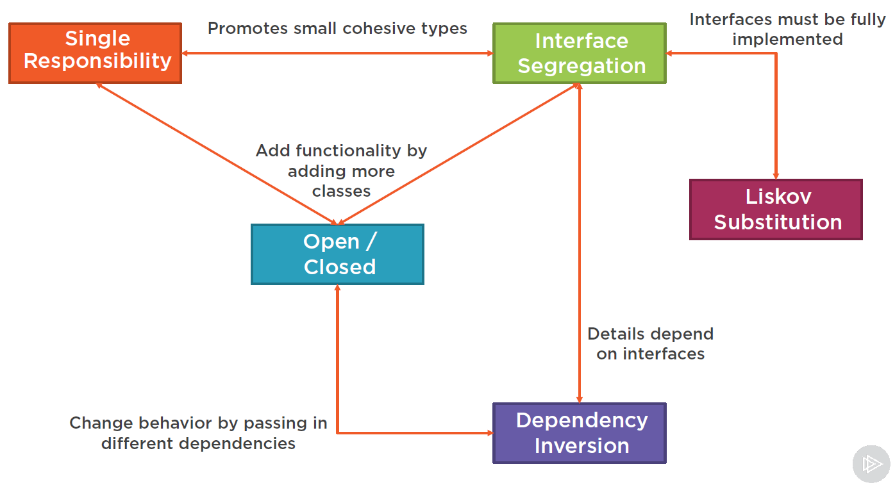

# Software Design & Architecture
This repo aims to track my notes of software design and architecture.

## SOLID Principles

Refer this [course][solid_principles_course] and [repo][solid_demo] by [Steve Smith](https://github.com/ardalis) for more details.

- Single responsibility

- Open-close

- Liskov substitution

- Interface segregation

- Dependency inversion

  - High-level modules should not depend on low-level modules. Both should depend on abstractions.
  - Abstractions should not depend on details, but the other way around.
  
  Relevant concepts are IoC (inversion of control) container, DI (dependency injection) strategy pattern.
  
  
  
  
  
  *Figure* 1 Relationships between SOLID principles  ([Steve Smith][solid_principles_course])
  
  

## Domain Driven Design

### Bounded context

ubiquitous language

### Entity


### Value object


### Aggregate


### Domain events


## Design Patterns

Refer to this [catalog](https://refactoring.guru/design-patterns/catalog) and [collection of courses](https://app.pluralsight.com/paths/skills/design-patterns-in-c).

### Factory

This code snippet comes from the [SOLID principle demo code][solid_demo]. It shows how to implement a factory pattern via reflection (`Activator` class in C#) which eliminates the usage of `switch` clause. The `ArdalisRating` namespace has a couple of policy rater classes: `AutoPolicyRater`,`LandPolicyRater`,`LifePolicyRater`, etc. Constructors of the policy rater has one argument, an `ILogger` instance.

```c#
 public class RaterFactory
    {
        private readonly ILogger _logger;

        public RaterFactory(ILogger logger)
        {
            _logger = logger;
        }

        public Rater Create(Policy policy)
        {
            try
            {
                return (Rater)Activator.CreateInstance(
                    Type.GetType($"ArdalisRating.{policy.Type}PolicyRater"),
                        new object[] { _logger });
            }
            catch
            {
                return new UnknownPolicyRater(_logger);
            }
        }
    }
```

The client code uses this factor as follow.

```c#
string policyJson = _policySource.GetPolicyFromSource();
var policy = _policySerializer.GetPolicyFromString(policyJson);
var rater = _raterFactory.Create(policy);
```


## References

1. [C# SOLID Principles][solid_principles_course]
2. [Demo code for SOLID principles][solid_demo]


[solid_principles_course]: https://app.pluralsight.com/library/courses/csharp-solid-principles/table-of-contents	"C# SOLID Principles"
[solid_demo]: https://github.com/ardalis/SolidSample " SOLID demo"

